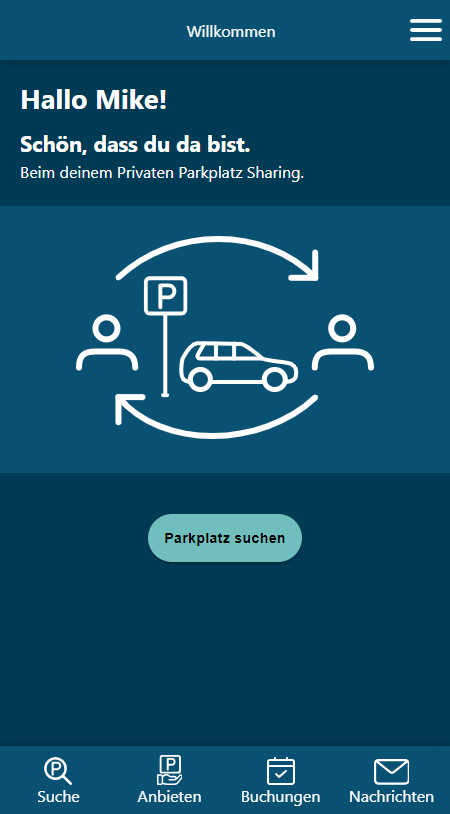
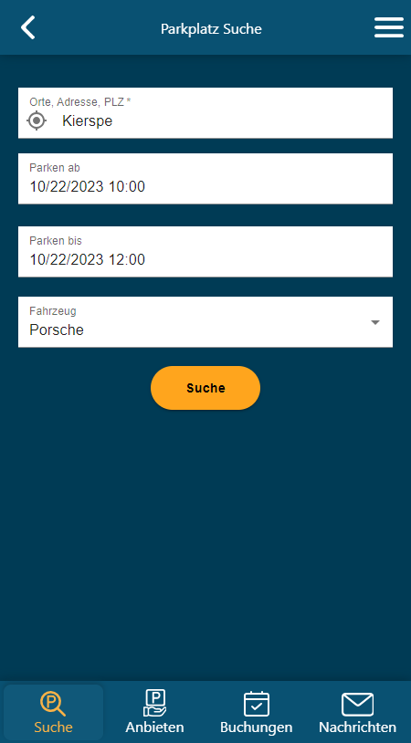
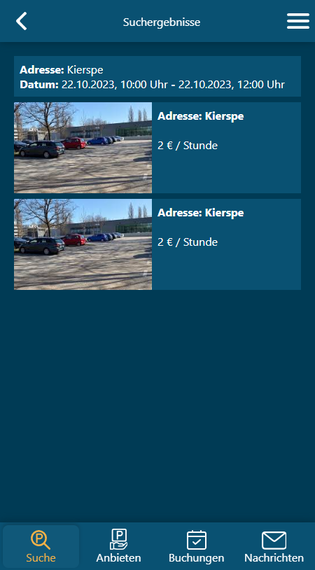

# Parkplatz-Sharing App

Die **Parkplatz-Sharing App** wurde im Rahmen eines 5-tägigen Projekts entwickelt, um meine Kenntnisse in React zu demonstrieren.

## Screenshots
  

## Installation 🔌
Folgen Sie diesen Schritten, um die App in Visual Studio Code zu installieren:

1. Laden Sie die Repository-Daten herunter, indem Sie den folgenden Befehl ausführen:
   ```shell
   git clone https://github.com/mikework24/park-app.git
   ```

2. Installieren Sie alle erforderlichen Abhängigkeiten mit dem Befehl:
   ```shell
   npm install
   ```

3. Starten Sie den JSON-Server mit dem Befehl:
   ```shell
   npx json-server --watch src/assets/db.json --port 3111
   ```

4. Starten Sie den HTML-Server mit dem Befehl:
   ```shell
   npm start
   ```

# Demo
Probieren Sie die App in der Live-Demo aus: [Parkplatz-Sharing App Demo](https://park-app.mike-work.com/)

# Registrierte Nutzer
Sie können sich mit einem der folgenden registrierten Benutzer anmelden:

Benutzer a@admin.com
Passwort: 88888888

Benutzer b@admin.com
Passwort: 88888888

Benutzer c@admin.com
Passwort: 88888888

Benutzer d@admin.com
Passwort: 88888888

Neue Benutzer können sich ebenfalls registrieren.

# Parkplatzsuche
Testen Sie die Parkplatzsuche in den folgenden Städten:
- Kierspe
- Köln